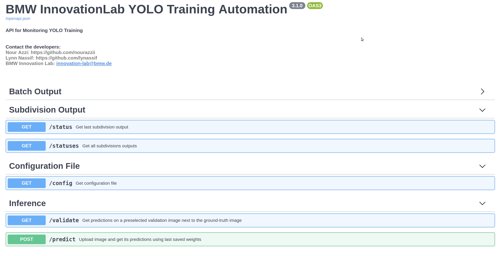
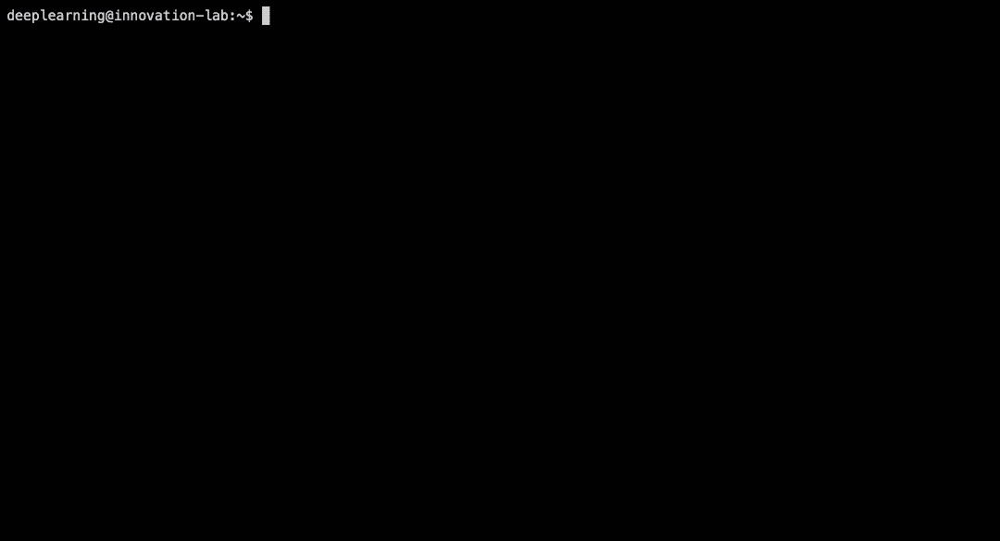
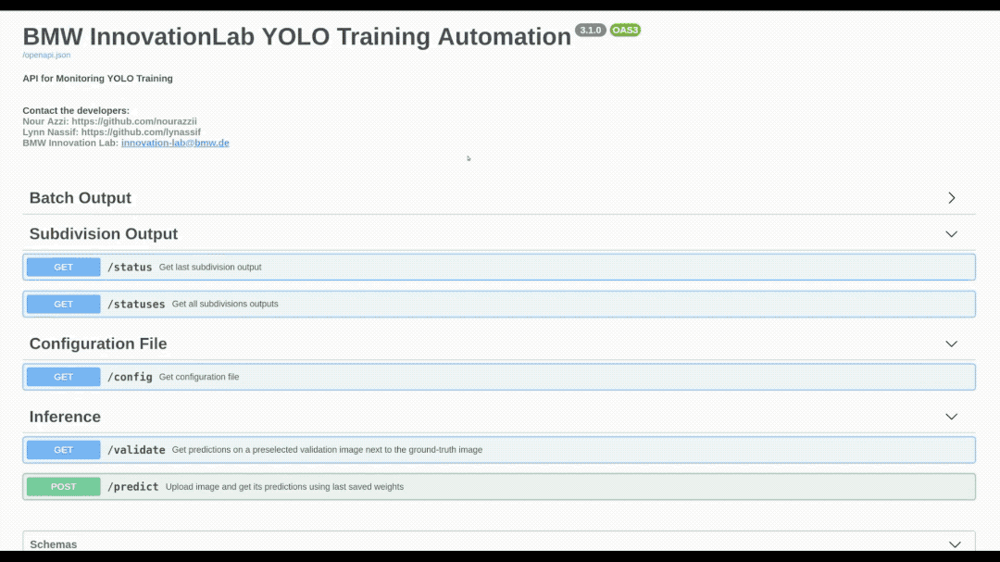
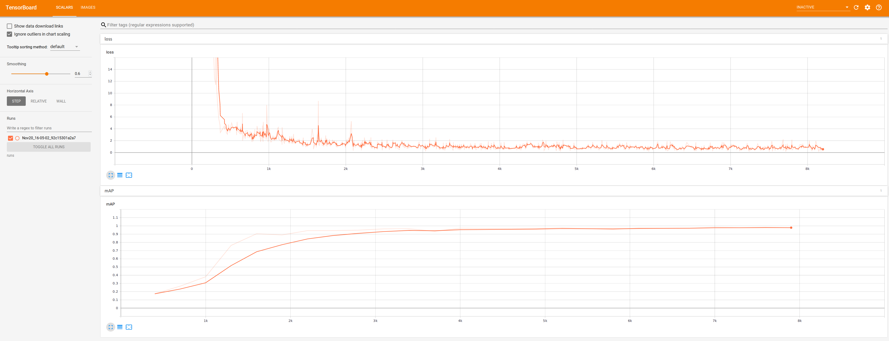

# YOLOv4-v3 Training Automation API for Linux

This repository, based on AlexeyAB's darknet repro, allows you to get started with training a state-of-the-art Deep Learning model with little to no configuration needed!  You provide your labeled dataset and you can start the training right away and monitor it in many different ways like TensorBoard or a custom REST API and GUI. Training with YOLOv4  has never been so easy.
This repository has also cross compatibility with Yolov3 training.

You can also use our BMW-Labeltool-lite to label your dataset with yolo labels format https://github.com/BMW-InnovationLab/BMW-Labeltool-Lite.git




## Prerequisites

- Ubuntu 18.04 [16.04 could work, but not tested]
- Install dependencies:
```bash
chmod +x scripts/install_dependencies.sh && source scripts/install_dependencies.sh
```
- Install docker:
```bash
chmod +x scripts/install_docker.sh && source scripts/install_docker.sh
```
- Install NVIDIA Drivers and NVIDIA Docker for GPU training by following the [official docs](https://github.com/nvidia/nvidia-docker/wiki/Installation-(version-2.0))

## At a glance

Prepare the docker image with all weights for GPU usage

```bash
sudo docker build -f docker/Dockerfile -t darknet_yolov4_gpu:1 --build-arg GPU=1 --build-arg CUDNN=1 --build-arg CUDNN_HALF=0 --build-arg OPENCV=1 --build-arg DOWNLOAD_ALL=1 .
```


By default we include everything you will need inside this build!
If you want to manually adjust the weights you can go to [Preparing weights](#preparing-weights)

After this step, jump directly to [Preparing your dataset](#preparing-your-dataset)

## Preparing Docker images

Once your environment is ready, you can prepare the docker images needed.
The environment is dockerized to run on GPU or CPU.
For GPU, you need to build the image in the following way:

```bash
sudo docker build -f docker/Dockerfile -t darknet_yolov4_gpu:1 --build-arg GPU=1 --build-arg CUDNN=1 --build-arg CUDNN_HALF=0 --build-arg OPENCV=1 .
```

If you have a GPU: Volta, Xavier, Turing and higher

```bash
sudo docker build -f docker/Dockerfile -t darknet_yolov4_gpu:1 --build-arg GPU=1 --build-arg CUDNN=1 --build-arg CUDNN_HALF=1 --build-arg OPENCV=1 .
```
If you are behind proxy 
```bash
sudo docker build -f docker/Dockerfile -t darknet_yolov4_gpu:1 --build-arg GPU=1 --build-arg CUDNN=1 --build-arg CUDNN_HALF=1 --build-arg OPENCV=1 --build-arg http_proxy='' --build-arg https_proxy='' .
```
For CPU only, you can run the same command while setting GPU=0 CUDNN=0 and naming it darknet_yolo_cpu:1 for clarity.

```bash
sudo docker build -f docker/Dockerfile -t darknet_yolov4_cpu:1 --build-arg GPU=0 --build-arg CUDNN=0 --build-arg CUDNN_HALF=0 --build-arg OPENCV=1 .
```
If you want multi-core cpu training you can add OPENMP=1 to the build 

```bash
sudo docker build -f docker/Dockerfile -t darknet_yolov4_cpu:1 --build-arg GPU=0 --build-arg CUDNN=0 --build-arg CUDNN_HALF=0 --build-arg OPENCV=1 --build-arg OPENMP=1 .
```

## Preparing your dataset

We provided a `sample_dataset` to show how your data should be structured in order to start the training seemlesly.
The `train_config.json` file found in `sample_dataset` is a copy of the template `config/train_config.json.template` with needed modifications.  The template can as well be copied as is while making sure to remove the '.template' from the name.
You can also provide your own `train.txt` and `test.txt` to specify which images will be used for training and which ones are for testing.  If not provided, the dataset will be split according to the `data/train_ratio` (by default 80% train 20% test).
If you are using **Yolov4** training please make sure to choose your `yolov4` instead of **yolov3** in `train_config.json`  `model/model-name` **Yolov4** specific hyperparams ("mosaic","blur")

## Starting the training

To start the training on GPU, make sure to add the execute permission on the .sh scripts (needed once only) by running 

```bash
chmod +x *.sh
./run_docker_linux_gpu.sh
```

This will ask for 2 main inputs:

- The **absolute** path for the dataset
- The name of the container to run (which will be also a prefix for the training output)
Once given, the training will start and you can stop it at any time by pressing CTRL+C inside the open terminal.  Closing the terminal will result in stopping the running container.

### Training output

Inside `trainings` you can find a folder with the naming convention <container_name>_<training_start_time>.
For example it can be dogs-dataset_20191110_14:21:41. Inside this folder you will have the following structure.

```
dogs-dataset_20191110_14:21:41
├── config
│   ├── obj.data
│   ├── obj.names
│   └── yolov4.cfg
├── test.txt
├── train.txt
├── weights
│   ├── initial.weights
│   ├── yolov4_10000.weights
│   ├── yolov4_1000.weights
│   ├── yolov4_2000.weights
│   ├── yolov4_3000.weights
│   ├── yolov4_4000.weights
│   ├── yolov4_5000.weights
│   ├── yolov4_6000.weights
│   ├── yolov4_7000.weights
│   ├── yolov4_8000.weights
│   ├── yolov4_9000.weights
│   ├── yolov4_best.weights
│   └── yolov4_last.weights
├── yolo_events.log
└── yolo_events.log.1
```

Which shows the .cfg file and weights used for the training along with all checkpoints and the normal yolo log output inside yolo_events files.

## Monitoring the training

You have 3 ways of monitoring the training.

### Custom API

One REST API with its Swagger API is also started during the training so you can get the YOLO output log in a structured JSON format as well as test custom images on the latest saved weights.  This can be accessed through port 8000 (or a custom port you can set inside training/custom_api/port)



### TensorboardX


The loss and mAP can be visualized through Tensorboard which can be accessed on port 6006 (or a custom port you can set inside training/tensorboard/port)



### AlexeyAB provided web_ui

This can be enabled by setting training/web_ui/enable to true in the `train_config.json` you provide during the training.  It can later on be access through port 8090 (or a custom port you can set inside training/web_ui/port) and looks like the following:


## Training config: Meaning

An explanation of different fields can be found in the json schema of the provided config, which can be found at `config/train_config_schema.json`
Some of the elements are specific to YOLO itself like saturation, hue, rotation, max_batches and so on.  Those are greatly explained by AlexeyAB in [their darknet fork](https://github.com/AlexeyAB/darknet).

## Benchmark

<table>
    <thead align="center">
        <tr>
            <th></th>
            <th colspan=3>Ubuntu</th>
        </tr>
    </thead>
    <thead align="center">
        <tr>
            <th>Network\Hardware</th>
            <th>Intel Xeon CPU 2.3 GHz</th>
            <th>Intel Core i9-7900 3.3 GHZ</th>
            <th>Tesla V100</th>
        </tr>
    </thead>
    <tbody align="center">
        <tr>
            <td>COCO Dataset</td>
            <td>0.259 seconds/image</td>
            <td>0.281 seconds/image</td>
            <td>0.0691 seconds/image</td>
        </tr>
    </tbody>
</table>

## Preparing weights

Default yolo weights are provided on the [official website](https://pjreddie.com/darknet/yolo/).
To download the different flavors, please use the following commands:

Change your current working directory to be inside the repo. The following steps will download 

yolov3.weights

```bash
wget https://github.com/AlexeyAB/darknet/releases/download/darknet_yolo_v3_optimal/yolov3.weights -P config/darknet/yolo_default_weights
```

yolov3-tiny.weights

```bash
wget https://pjreddie.com/media/files/yolov3-tiny.weights -P config/darknet/yolo_default_weights
```

darknet53.conv.74

```bash
wget https://pjreddie.com/media/files/darknet53.conv.74 -P config/darknet/yolo_default_weights
```

 yolov4.weights

```bash
wget https://github.com/AlexeyAB/darknet/releases/download/darknet_yolo_v3_optimal/yolov4.weights -P config/darknet/yolov4_default_weights
```


## Known Issues

Issue related to darknet itself can be filed in [the correct repo](https://github.com/AlexeyAB/darknet).  We did not make any changes to the darknet code itself.

- If you chose to build with GPU but in the configuration file did not provide "gpus" field, the training will run on gpu 0 by default
- If during training you see nan values for avg (loss) field - then training goes wrong, but if nan is in some other lines - then training goes well.
- If error Out of memory occurs then you should try increasing subdivisions to 16, 32 or 64 or have a smaller image size.
- If training finishes immediately without any error you should decrease batch size and subdivisions.
- if training on multiple GPU produce nan try decreasing the learning rate to 0,00065


## Acknowledgements

[robotron.de](https://www.robotron.de/)

[inmind.ai](https://www.inmind.ai/)

AlexeyAB (https://github.com/AlexeyAB)

Lynn Nassif, Beirut, Lebanon

Nour Azzi, Beirut, Lebanon

Hadi Koubeissy , Beirut, Lebanon
